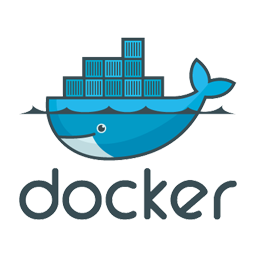

**World Of Games (WoG)**

CLI gaming platform that allows player to choose and play a command line based game.
this project was created during DevOps training course and demonstrates Python coding,
working with Flask and HTML page creation and publishing, 
using Docker (& Docker-compose) to package the app into a container and running it
in a Jenkins Pipeline with some Selenium automation tests on the games scoreboard.

The program will install all needed python module dependencies, 
Prompt user to enter player name and display the available games menu.

Player will need to choose a game and difficulty level. 
Python flask module is used to display the leaderboard on HTML web page 
and can be accessed from: 127.0.0.1:5000 once running.

**Execution**

WoG platform can be run locally using the built in bat for Windows, and sh files for Unix\Linux. 
The web page will automatically open in the default browser showing the Score of all the total plat until now. 
Once closed, the platform and the flask application will be purged from active memory 
and will no longer be accessible.

**Testing, Jenkins and Pipeline fun**

You can run the test pipeline using the already, available Jenkinsfile. 
However, to push the build image to your own docker hub you will need to provide 

**Environment and minimum requirements**

The platform was made compatible with Windows, Linux, Mac operating systems CLI.
the platform was written is python3.8 code infrastructure, 
as such Python 3.8 and pip installer must be present on system.
Jenkins and Docker are needed to run the testing pipeline.

            

**Features**

self compiling games menu (will include all .py modules present in the ../WorldOfGames/Games/ folder.)

Adding new games to the platform
The platform was designed to allow easy game addition by including a new game file 
into the ../WorldOfGames/Games/ folder. 
The game must be written in python 3.8 compatible script.

